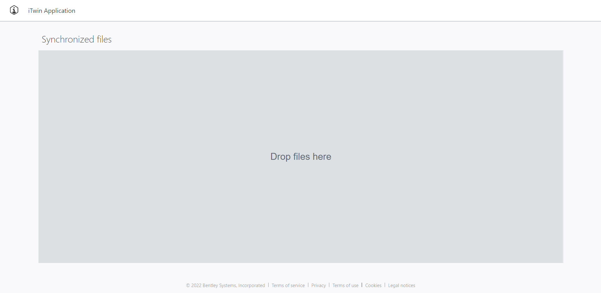
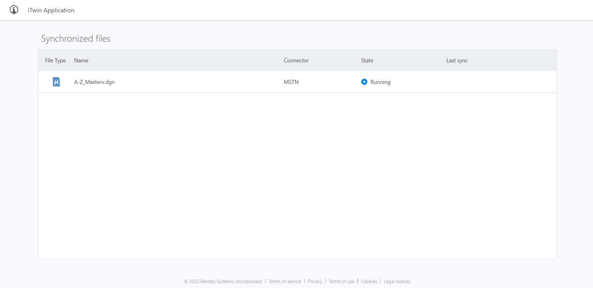
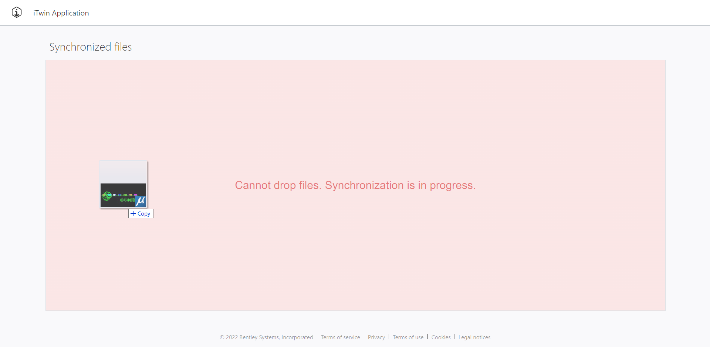
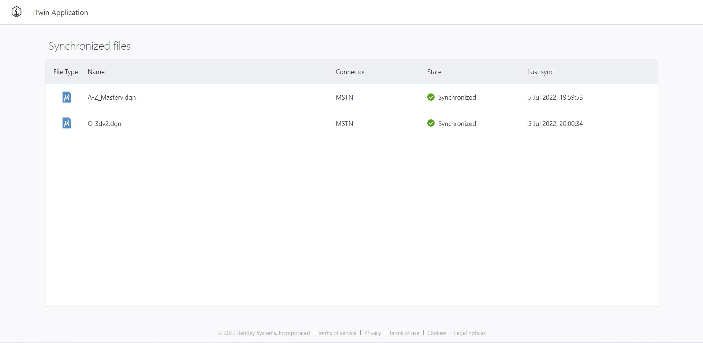

# Synchronization Storage API Sample

This is a code sample application that demonstrates usage of [Synchronization](https://developer.bentley.com/api-groups/synchronization/) API at [Bentley iTwin developer platform](https://developer.bentley.com).

For better understanding of Synchronization and Storage APIs, please refer to this [tutorial](https://developer.bentley.com/tutorials/synchronization-storage-tutorial/).

## Prerequisites

- [Git](https://git-scm.com/)
- [TypeScript](https://www.typescriptlang.org/)
- [Node](https://nodejs.org/en/): an installation of the latest security patch of Node 16. The Node installation also includes the **npm** package manager.
- [Visual Studio Code](https://code.visualstudio.com/): an optional dependency, but the repository structure is optimized for its use.

## Setup

Please make sure to follow these steps for running this code sample application:

1.  Clone this repository.
1.  Make sure npm or yarn is installed on your machine.
1.  Register a new SPA at [My Apps](https://developer.bentley.com/my-apps/) with:

    - Scopes: `synchronization:read`, `synchronization:modify`, `storage:read`, `storage:modify`, `projects:read`, `imodels:read`, `imodels:modify`.
    - Redirect Urls: `http://localhost:3000/signin-oidc`.

1.  Create an [empty iModel](https://developer.bentley.com/my-imodels/). Note down context and iModel IDs.
1.  `.env` file is required for setting up enviromental variables used by application. Create `.env` file at application root and fill out required environmental variables.

    ```
    REACT_APP_ITWIN_ID=<context ID>   // `REACT_APP_ITWIN_ID` is your created iTwin ID. If you already have a Project pass Project ID in place of the iTwin ID, please refer to this guide:: https://developer.bentley.com/apis/itwins/#faq
    REACT_APP_IMODEL_ID=<iModel ID>   // `REACT_APP_IMODEL_ID` is your created iModel ID.
    REACT_APP_CLIENT_ID=<client ID>   // `REACT_APP_CLIENT_ID` is your [registered application's](https://developer.bentley.com/my-apps/) Client ID.
    ```

1.  Run `yarn` in command line to install required packages.
1.  Run `yarn run start` to run the application. Navigate to localhost:3000 in your browser.

## Code overview

Code is documented to help user understand how data is being used from each API call, how authorization workflow is implemented, what is the purpose of each component and some other minor details.

We encourage user to understand how OAuth2 authorization workflow is implemented. In this code sample, authentication flow implementation details can be found at `src/auth` files.

`src/components` is where most of the application logic is written. Component namings are self-explanatory, refer to each for further explanations of each API call and how the data is used.

## Application overview

### Starting state

If the iModel from `.env` file is empty, the page displays a gray drop area. When the user drags and drops some file(s), the area will change depending on the file type: either turn red and show a message with allowed file types or turn green and notify that the files are being uploaded to storage.


### Synchronization in progress state

When files are uploaded to storage, the synchronization process begins. A table containing information about each file is displayed with constant updates until the synchronization process is finished.


During the synchronization process the user is not allowed to drop files in the area. Dragging a file over the drop area will show a warning. If a file is dropped despite the warning, nothing will happen.


### Synchronization done state

When every file is synchronized and the process is fully finished, the page will display the table and will allow to drop more files in the drop area (the area overlay will only be shown when a file is dragged over it).

