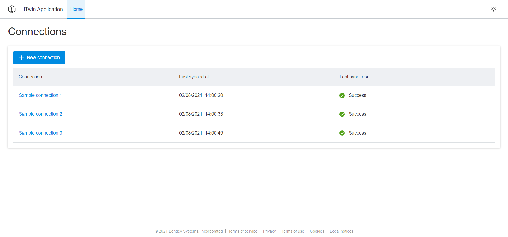
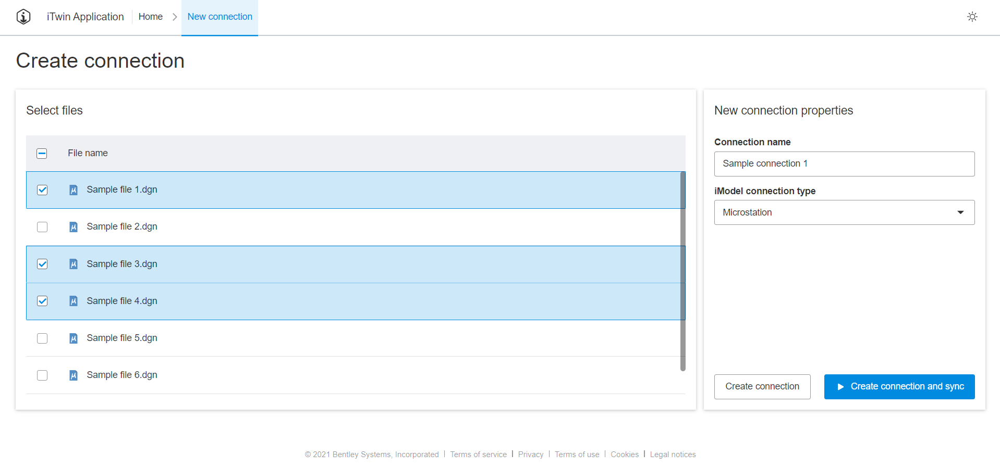
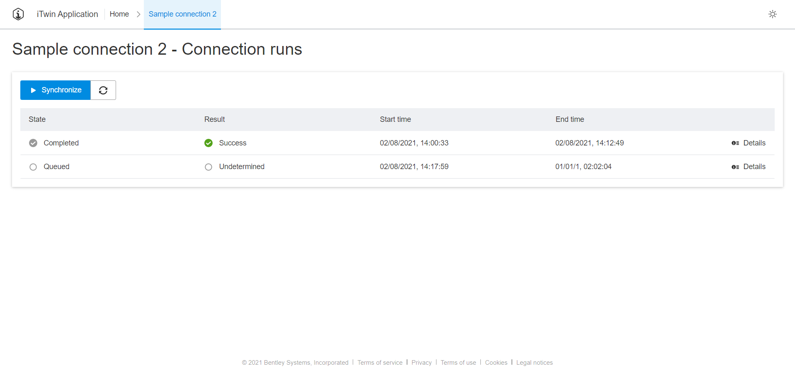

# Sample synchronization portal application

This is a code sample application that demonstrates usage of [Synchronization](https://developer.bentley.com/api-groups/synchronization/) API at [Bentley iTwin developer platform](https://developer.bentley.com).

For better understanding of Synchronization and Storage APIs, please refer to this [tutorial](https://developer.bentley.com/tutorials/synchronization-tutorial/).

## Setup

Please make sure to follow these steps for running this code sample application:

1.  Clone this repository: https://github.com/iTwin/synchronization-api-sample-app.git.
1.  Make sure npm and yarn are installed on your machine.
1.  Register a new SPA at [My Apps](https://developer.bentley.com/my-apps/) with the following scopes: `synchronization:read synchronization:modify storage:read projects:read`. For redirect uris, provide `http://localhost:3000/signin-oidc`.
1.  Create an [empty iModel](https://developer.bentley.com/my-imodels/). Note down context and iModel IDs.
1.  Upload some .dgn files using [Storage API](https://developer.bentley.com/api-groups/data-management/apis/storage/).
1.  `.env` file is required for setting up enviromental variables used by application. Create `.env` file at application root and fill out `REACT_APP_CONTEXT_ID`, `REACT_APP_IMODEL_ID` and `REACT_APP_CLIENT_ID` enviromental variables. `REACT_APP_CLIENT_ID` is your [registered application's](https://developer.bentley.com/my-apps/) Client ID. The file contents should be like this:

        REACT_APP_CONTEXT_ID=<Your Context ID>
        REACT_APP_IMODEL_ID=<Your iModel ID>
        REACT_APP_CLIENT_ID=<Your client ID>

1.  Run `yarn` in command line to install required packages.
1.  Run `yarn start` to run the application. Navigate to localhost:3000 in your browser.

## Code overview

Code is documented to help user understand how data is being used from each API call, how authorization workflow is implemented, what is the purpose of each page and some other minor details.

We encourage user to understand how OAuth2 authorization workflow is implemented. In this code sample, authentication flow implementation details can be found at `src/auth` files.

`src/components` is where most of the application logic is written. Component namings are self-explanatory, refer to each for further explanations of each API call and how the data is used.

## Application overview

### Home page

This page displays all connections for the provided iModel in `.env` file. Clicking on a connection name in a table cell will navigate to that specific connection's runs page. By clicking "New connection", user will be navigated to another page for creating connections.

### Create connection page

A page that is used for creating new connections. Upon loading, this page fetches files from storage's root folder, while storage is referenced by the provided project ID in `.env` file. User can then select files, provide required information and finish creating a connection. If the file list is empty, user will have to upload some .dgn files using [Storage API](https://developer.bentley.com/api-groups/data-management/apis/storage/).

### Connection runs page

A page where connection's synchronization progress can be monitored. The table displays current and previous connection synchronization runs. Each run can be further inspected by clicking "Details" button - this will display a table modal with more specific tasks that were executed.

